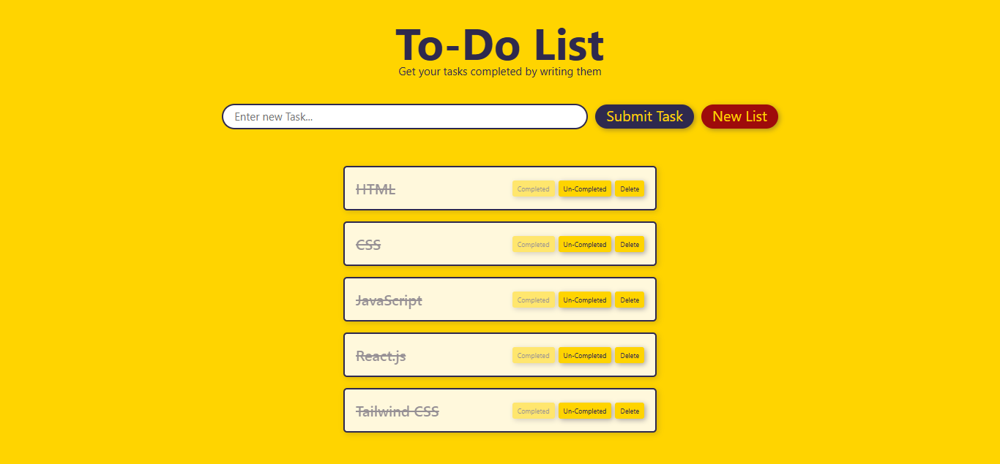

#  To-Do List Web App
A clean, functional, and fully responsive To-Do List web application, built using only **HTML**, **CSS**, and **JavaScript**.

##  Screenshot

##  Features
-  **Add New Tasks**  
-  **Mark Tasks as Completed / Un-Completed**  
-  **Delete Individual Tasks**  
-  **Clear All Tasks**  
-  **Fully Responsive Design**  
-  **Persistent Storage with `localStorage`**  
  Your tasks are stored in the browser using `localStorage`. Even after closing or refreshing the browser, your list remains exactly as it was.  
  - Tasks are saved as a JSON string  
  - On page load, the app retrieves and parses this data to restore your task list  
  - Every add, delete, or toggle is synced with `localStorage`, so nothing gets lost  

##  Developer’s Journey
This project was not just about building a to-do app, it taught me a **lot of things**.
### The Struggle with `localStorage`
At first, I struggled a lot with how to **save tasks persistently**. The concept of `localStorage` was completely new to me, and I had to learn how to:
- Store arrays
- Parse JSON
- Update it dynamically on state changes
After multiple failures, I finally cracked it!
###  Learning DOM Manipulation
I learned:
- How to use `createElement()`, `appendChild()`, `querySelector()`
- How DOM nodes and their relationships work
- How to add elements dynamically using JavaScript
- How to add event listeners to those dynamic elements
This was my **first real experience** with **vanilla DOM manipulation**, and it built the foundation of my DOM knowledge.